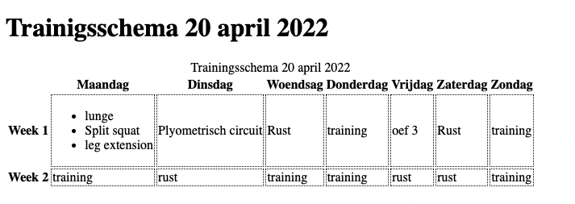
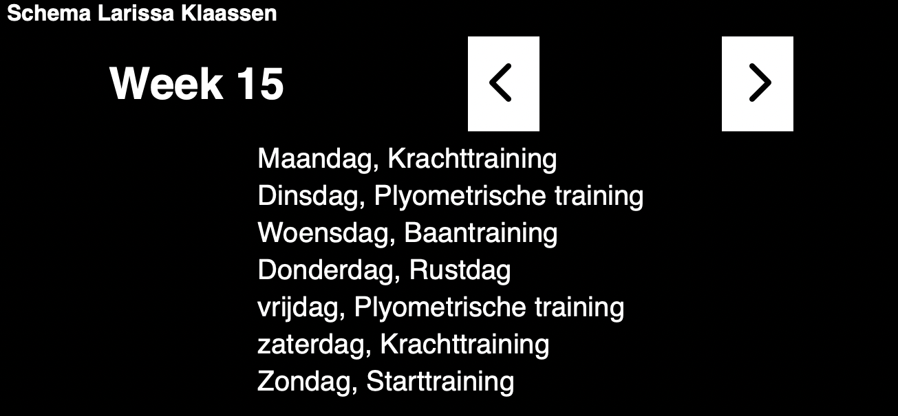
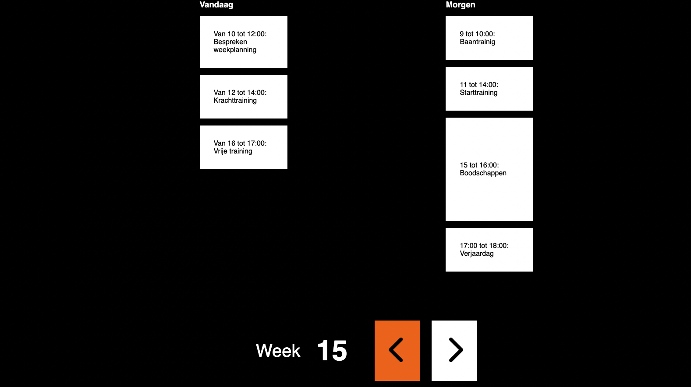

# Trainingsoverzich Larissa Klaassen

## Contents

- [Installation](#installation)
- [User scenario](#user-scenario)
- [Larissa Klaassen](#larissa-klaassen)
  - [Huidige situatie](#huidige-situatie)
- [Eerste meeting](#eerste-meeting)
  - [Concept](#concept)
  - Resultaten
- Tweede meeting
  - Concept
  - Resultaten
- Laatste meeting
  - Concept
  - Resultaten
- Exclusive design

## Installation

To install run `git clone https://github.com/KaivWezel/human-centered-design-2122.git`
You can find the concepts in the concepts-directory. You can simply open them in the browser to check them out.

The first concept can be started using `npm run dev`. This version will be available at localhost:3000 when started.

## User scenario

Als topsporter wil ik snel mijn agenda op de korte termijn kunnen raadplegen zodat ik weet wat mij te wachten staat voor de training.

## Larissa Klaassen

Larissa is topsporter en heeft onlangs nog goud gewonnen op de paralympische spelen in Tokyo op het onderdeel baanwielrennen. Als topsporter heeft ze een druk trainigsschema en is ze bijna elke dag wel aan het trainen. De diversiteit in trainingen en oefeningen is zo groot dat een agenda haar goed van pas zou komen. De chaoot die ze zelf zegt te zijn, heeft niet altijd alles op een rijtje en luistert ook niet per se naar wat de coach zegt dat ze moet doen. Ze wil nog wel eens haar eigen plan trekken.

### Huidige situatie

De huidige sitautie is iets anders dan beschreven in de opdracht. Zo hebben we helaas ook geen traningsschema kunnen krijgen dat kleurgecodeerd was. In plaats daarvan hebben we de situatie van Larissa zelf goed moeten uithoren om de opdracht te kunnen aanscherpen. In haar huidige ritme is ze elke dag aan het trainen en daar heeft ze schema's voor. Echter, de huidige, nieuwe, coach weet nog niet zoveel van het baanwielrennen als zijzelf vindt ze en daarom trekt ze vaak haar eigen plan. Het omzetten van de kleurenschema's was dan ook niet per se een _must_ voor haar.

## Eerste meeting

Omdat we vanuit de opdracht en beschikbare materialen geen situatie konden opmaken hebben we als groep de eerste meeting gebruikt om vooral vragen te stellen aan Larissa en te kijken hoe zij omgaat met screenreaders.

### Concept

Het concept dat ik had gemaakt om te testen was een simpele HTML-tabel. Al mijn hele leven leer ik hier dat ik die dingen semantisch correct moet maken en zoveel mogelijk attributen moet meegeven zodat de screenreader die kan uitlezen.
Voordat ik dit zelf kon testen was ik een uurtje bezig om de screenreader te leren besturen. Om een of andere reden hebben ze bedacht dat je toetscombinaties van 4 toetsen moet gebruiken voor de besturing.

Uiteindelijk werkte het goed en is een HTML-tabel ook goed leesbaar voor de screenreader, er wordt fijn herhaald in welke kolom/rij je zit bij het navigeren door de tabel en ook de titel van de desbetreffende kolom/rij herhaald.

### Resultaten test 1

Helaas was de realiteit harder dan gedacht, zodra ik deze tabel voorlegde aan Larissa was het eerste wat ze deed op `tab` drukken. Dat is pech, want standaard `tab`'t de browser of de screenreader niet naar een tabel, maar naar de eerstvolgende link of heading. Dat betekent dat in elke context mijn tabel wordt overgeslagen. Larissa houdt van de `tab` toets omdat het eel makkelijker is om maar 2 of drie toetsen los te gebruiken in plaats van combinaties van 4 of 5 toetsen te gelijk. Hierna maar weer terug naar de tekentafel en kijken hoe we dit gaan toepassen voor haar.

#### Bevindingen

- Larissa krijgt wel programma's maar doet het liefst haar eigen ding.
- Larissa gebruikt de screenreader **Jaws**, de screenreader onerschept de code van de cpu naar gpu om te achterhalen wat de content is op de webpagina.
- Larissa gebruikt het liefst `tab` om door de website te gaan, en tabellen worden dan niet bereikt.
- Larissa houdt van fitness en doet het liefst krachttraining, ze houdt haar progressie bij met notities.
- Larissa is een chaotisch persoon en zou misschien wel wat organisatie kunnen gebruiken.

## Tweede meeting

Voor de tweede meeting had ik ook een kleine test voorbereid. Mijn concept had ik gemaakt om bepaalde doelstellingen gemakkelijk te kunnen behalen. Deze doelstellingen had ik in vorm van oprachten opgesteld om zo te bepalen of zij ze snapte en ook behaalde.

**Opdrachten**

- Kijk wat voor training je hebt op woensdag in week 3
- Check of je ruimte hebt om weekend in week 34 weg te gaan.

Deze opdrachten moesten mij inzicht geven in de navigatie die ik gemaakt had. Was deze duidelijk en makkelijk te bedienen.

### Concept

Dit concept was gemaakt om snel een weekoverzicht te hebben van je trainingen. Bovenaan staat duidelijk in welke week je je bevind en deze werd voorgelezen. De twee knoppen veranderden de week waar je naar keek en gaven meteen feedback over in welke week je nu keek. Daarnaast kon je per dag luisteren wat er gepland stond en dat allemaal met tab.
In dit ontwerp is ook rekening gehouden met contrast, omdat Larissa nog wel een klein verschil in licht en donker kan zien. Door gebruik te maken van een hoog contrast kan ze ongeveer zien waar zich elementen bevinden en welk element geselcteerd is.

### Resultaten test 2

Tijdens de test kwam 1 ding goed naar voren, ik had nog niet aan de details gewerkt. Zo wilde Larissa tussen de eerste en tweede opdracht van week 3 naar week 34 gaan door naar 1 te klikken en dan via nog een stap bij week 52 uit te komen. In plaats daarvan ging ze naar week -1 en dus moest ze nog 36 keer klikken.
Wat wel heel fijn was vond ze, is dat er bij het navigeren door de weken gelijk feedback kwam van de navigatie. Elke keer als je een week verder of terug klikt zegt de navigatie in welke week je nu zit. Dit vond zij eigenlijk een must-have in volgende ontwerpen.

#### Bevindingen

- Grote knoppen voor navigatie zijn goed, heel fijn dat er gelijk feedback is.
- Sneller door weken navigeren zou prettig zijn en dan niet de negatieve weken in kunnen.
- Een date-picker voor belangrijke of interessante data zou handig zijn.
- Vandaag en morgen zijn voor Larissa het belangrijkst, verder kijkt ze vooral globaal wat er aan komt.
- Iet met contrast in de gefocuste elementen zou top zijn zodat ze net kan zien waar ze zich op de pagina bevindt.

## Laatste Meeting

De laatste meeting was iets sneller dan gedacht dus ik had minder aanpassingen kunnen doen dan gewild, maar desalnietttemin een goede test kunnen afnemen. Ik heb dezelfde opdrachten gebruikt als in de tweede meeting, om te kijken of er verbetering in het proces zat.

### Concept

In het laatste concept dat ik heb voorgelegd heb ik een extra onderdeel toegevoegd aan de planner. De snelle agenda, het onderdeel bovenaan de afbeelding is een snelle manier om vandaag en morgen te kunnen bekijken. Zoals Larissa aangaf keek ze vooral naar vandaag en morgen om te kijken hoe planning eruit zag. Op deze manier laat ik vandaag en morgen gedetailleerd zien en kan ze daaronder ook nog haar weekoverzichten krijgen. Ik heb een focusstate duidelijker gemaakt met haar favoriete kleur oranje en ook de week kan nu zelf ingevuld worden met getallen zodat je niet van 1 tot 52 moet klikken.

### Resultaten test 3

De derde test was het meest nuttig en bracht mij richting een totaalidee voor Larissa om haar schema's gemakkelijk te kunnen bekijken. Toen ze door de applicatie heen klikte met tab wilde ze in het weekoverzicht ook zo'n zelfde schema naar voren halen als in de snelle agenda, dit had ik helaas nog niet gemaakt, maar is goed te implementeren. Daarnaast was er een beetje verwarring omdat de knoppen van de weeknavigatie gelijk na de week titel komen. Hierdoor leek het alsof de week leeg was.

#### Bevindingen

- De gedetailleerde view is erg fijn in blokken opgedeeld, dit kon ze nog net zien. Deze zou ze ook graag willen in het weekoverzicht.
- De feedback die meteen wordt gegeven is nog steeds erg fijn.
- Week-picker is fijn maar door de knoppen onder de weken te zetten kan het verwarring voorkomen.
  - week 'x' -> content -> week verder/terug (navigatie); in die volgorde

## Wat verder?

In een volgende iteratie zou ik graag de punten van test 3 willen aanpakken. De gedetailleerde view toepassen in het weekoverzicht lijkt mij het belangrijkste. Door door de weken te navigeren en een dag te selecteren zou je dan het gedetailleerde overzicht krijgen van die dag.
Verder zou ik nog een systeem willen maken zodat de datum (maand en dag) ook weergegeven kunnen worden in de agenda, dit maakt het overzicht dan compleet.

- [ ] Detail feature voor elke dag in het jaar
- [ ] Datum systeem automatisch op jaarkalender

## Exclusive design principles principles

### Study situation

De situatie van Larissa is eigenlijk alles behalve zoals omschreven in de opdracht. De kleurgecodeerde schema's gebruikt ze het liefst niet en de braille-regel die genoemd werd heeft ze wel, maar ze weet bijna niet eens hoe die werkt. Het is maar goed dat we de eerste meeting goed hebben gevraagd naar hoe ze haar trainingen vormgeeft. Larissa haar favoriete toest is dus `tab`, en dit komt de toegankelijkheid niet ten goede. Veelal kun je binnnen een website door elementen navigeren met andere toetscombinaties, die zij niet uit haar hoofd weet en ook niet wil gebruiken.
Daarnaast is Larissa sowieso een eigenwijsje en zal het meeste dat haar voorgedragen wordt niet zo gebruikt worden als het bedoeld is.

Larissa is gemakkelijk in de omgang en vindt het niet erg om te testen. Daarom is veel testen met Larissa alleen maar leuk en geeft ook goede inzicht in het prototype dat je hebt.

### Prioritise identity

De favoriete kleur van Larissa is oranje, niet gek want ze is onderdeel van TeamNL. Daarom ik heb ik de focusstate oranje gemaakt. Deze trekt de aandacht naar zich toe en heeft voldoende contrast van zowel het zwart als het wit. Verder valt er weinig te zien voor haar dus heb ik elementen groter gemaakt. Zo kan ze onderscheid maken in de elementen en ook zien dat er iets beweegt wanneer de focus naar beneden verplaatst.

### Ignore conventions

Hoewel de conventie van een HTML tabel voor een screenreader goed is voor de screenreader, was dit slecht voor Larissa. Alle onderdelen een `tabindex` geven is tegen alle conventies in, maar werkte voor Larissa dan weer heel goed. Dit is een voorbeeld waarom de conventies genegeerd mogen worden.

### Add Nonsense

Hoewel nonsense leuk klinkt, vind ik het niet gepast in deze applicatie. Ik erover nagedacht om de screenreader leuke/grappige tekstjes te laten voorlezen maar dat is een keer leuk. Stel dat je de app echt in gebruik neemt, dan wordt het vanzelf vervelend. De app dient om snel je agenda te kunnen checken en vooral dan vandaag en morgen. Daar wil je zo min mogelijk nonsense bij hebben en zo snel mogelijk weten wat er moet gebeuren zodat je door kan met de orde van de dag en zo nodig haast kan maken.

Wat ik wel leuk had gevonden, maar nog geen tijd voor had gevonden is om kleine spraakberichtjes toe te voegen. Wanneer een afspraak bijvoorbeeld bijna begint, te zeggen dat ze haast moet gaan maken of juist dat ze nog even kan blijven zitten wanneer het nog even duurt tot de volgende afspraak. Dit was nog een leuke nonsense feature geweest maar hier heb ik helaas dus geen tijd voor gehad.

## Bronnen

- [MDN](https://developer.mozilla.org/en-US/) Voor algemene code dingetjes
- [Tink](https://tink.uk/how-screen-readers-navigate-data-tables/) Voor het gebruik van HTML-tables met screenreaders
- [W3](https://www.w3.org/WAI/tutorials/tables/) Voor het stylen van de HTML-table
- [MDN ARIA](https://developer.mozilla.org/en-US/docs/Web/Accessibility/ARIA) Voor het gebruik van ARIA voor screen readers.
